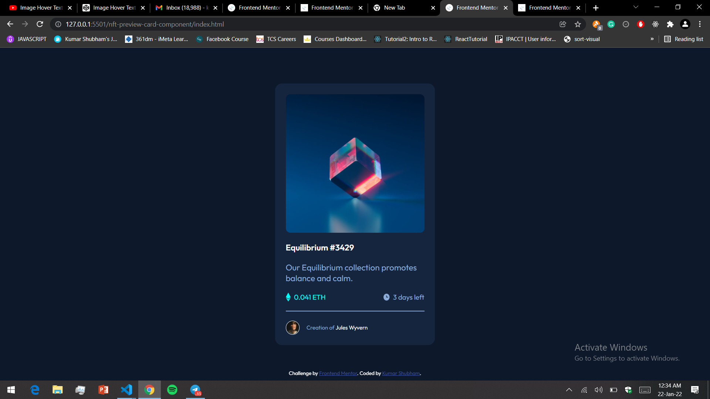

# Frontend Mentor - NFT preview card component solution

This is a solution to the [NFT preview card component challenge on Frontend Mentor](https://www.frontendmentor.io/challenges/nft-preview-card-component-SbdUL_w0U). Frontend Mentor challenges help you improve your coding skills by building realistic projects.

## Table of contents

- [Overview](#overview)
  - [The challenge](#the-challenge)
  - [Screenshot](#screenshot)
  - [Links](#links)
- [My process](#my-process)

  - [Built with](#built-with)
  - [What I learned](#what-i-learned)

- [Author](#author)

**Note: Delete this note and update the table of contents based on what sections you keep.**

## Overview

### The challenge

Users should be able to:

- View the optimal layout depending on their device's screen size
- See hover states for interactive elements

### Screenshot

### Links

- Solution URL: [Click here](https://github.com/Shubham-503/FrontEnd-Mentor/tree/master/nft-preview-card-component)
- Live Site URL: [Click here](https://kshubham07-frontend-mentor.netlify.app/nft-preview-card-component/index.html)

## My process

### Built with

- Semantic HTML5 markup
- CSS custom properties
- Flexbox

### What I learned

Most difficult task of this project was to use overlay of color on card images and correct usaage of CSS position property

## Author

- Website - [Shubham](https://shubham025.netlify.app/)
- Frontend Mentor - [Shubham-503](https://www.frontendmentor.io/profile/Shubham-503)
